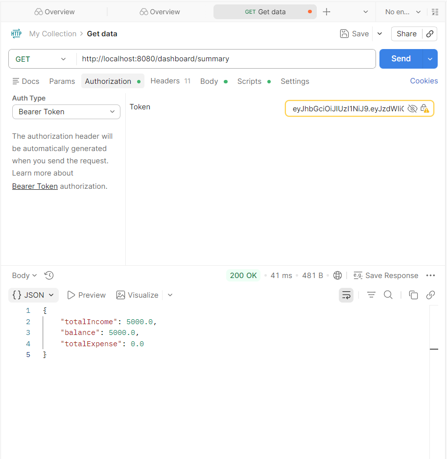

# 💰 Finance Dashboard Backend

<div align="center">


*A secure and scalable finance backend built using Spring Boot with role-based access control*

</div>

---

## 🎯 What This Project Does

This is a **Finance Dashboard Backend System** that allows users to:

- Manage income and expenses
- Track financial records
- View analytics and summaries
- Access features based on roles (Admin, Analyst, Viewer)

---

## ✨ Key Features

### 🔐 Authentication & Security
- JWT-based authentication
- Secure login system
- Password validation
- Role-based access control

---

### 👥 User Management
- Create and manage users
- Assign roles (ADMIN, ANALYST, VIEWER)
- Enable/disable users

---

### 💰 Financial Records
- Add income & expense records
- Categorize transactions
- Filter by type and category
- CRUD operations

---

### 📊 Dashboard APIs
- Total income
- Total expenses
- Net balance
- Category-wise breakdown
- Monthly trends

---

## 🛠️ Tech Stack

- **Backend:** Spring Boot
- **Database:** PostgreSQL
- **ORM:** Hibernate (JPA)
- **Security:** Spring Security + JWT
- **Build Tool:** Maven

---

## 🚀 Getting Started

### 1️⃣ Clone the repository
```bash
git clone https://github.com/YOUR_USERNAME/finance-dashboard-backend.git
cd finance-dashboard-backend 

```
### 2️⃣ Setup Database
```bash
CREATE DATABASE finance_db;

```
3️⃣ Configure application.properties
```bash
spring.datasource.url=jdbc:postgresql://localhost:5432/finance_db
spring.datasource.username=postgres
spring.datasource.password=your_password

```
4️⃣ Run Application
```bash
mvn spring-boot:run

```
🔑 API Endpoints

🔐 Auth
POST /auth/login

👤 Users
POST /users
GET /users

💰 Records
POST /records
GET /records

📂 Project Structure
```bash
src/main/java/com/finance/dashboard
│
├── controller/
├── service/
├── repository/
├── model/
├── dto/
├── security/

```


